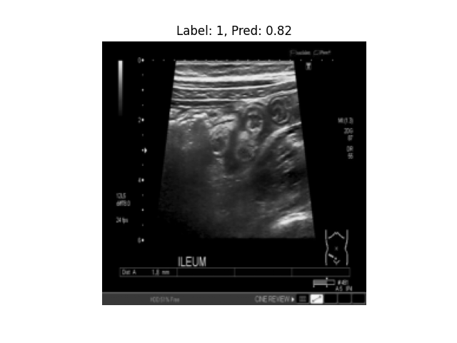

Absolutely! Here's the updated and polished README for your ultrasound classification project, now including the Regensburg Pediatric Appendicitis Dataset and its citation.

---

# Ultrasound Binary Classification with ResNet50


*A PyTorch project for binary classification of grayscale ultrasound images using a pretrained ResNet50 backbone.*

---

## 📚 Overview

This project implements a **transfer learning pipeline** for binary classification of grayscale ultrasound images:

* **ResNet50 Backbone** pretrained on ImageNet
* **Frozen backbone initially** to prevent overfitting on small datasets
* **BCEWithLogitsLoss** for stable binary classification
* **Learning rate scheduler** for smooth convergence

Ideal for researchers and developers working with **small medical imaging datasets**.

---

## 🧠 Dataset

This project utilizes the **Regensburg Pediatric Appendicitis Dataset**, which was acquired in a retrospective study from a cohort of pediatric patients admitted with abdominal pain to Children’s Hospital St. Hedwig in Regensburg, Germany. The dataset includes:

* **Multiple abdominal B-mode ultrasound images** for most patients
* **Tabular data** comprising laboratory tests, physical examination results, clinical scores (e.g., Alvarado and pediatric appendicitis scores), and expert-produced ultrasonographic findings
* **Three target variables**: diagnosis (appendicitis vs. no appendicitis), management (surgical vs. conservative), and severity (complicated vs. uncomplicated or no appendicitis)

The study was approved by the Ethics Committee of the University of Regensburg (no. 18-1063-101, 18-1063\_1-101, and 18-1063\_2-101) and was performed following applicable guidelines and regulations. ([Zenodo][1])


[](https://doi.org/10.5281/zenodo.7669442)


---

## ⚙️ Installation

Clone the repository and install dependencies:

```bash
git clone https://github.com/yourusername/ultrasound-resnet50.git
cd ultrasound-resnet50
pip install -r requirements.txt
```

**Dependencies:**

* Python 3.10+
* PyTorch 2.x
* torchvision
* PIL / Pillow
* numpy

---

## 🖼️ Project Showcase

The GIF below shows **grayscale ultrasound images** with the model’s predictions:

* **Label** = ground truth
* **Pred** = predicted probability




---

## 📄 License

This project is licensed under the **MIT License** – see the [LICENSE](LICENSE) file.

---

If you need further assistance or adjustments, feel free to ask!

[1]: https://zenodo.org/records/7669442?utm_source=chatgpt.com "Regensburg Pediatric Appendicitis Dataset - Zenodo"
